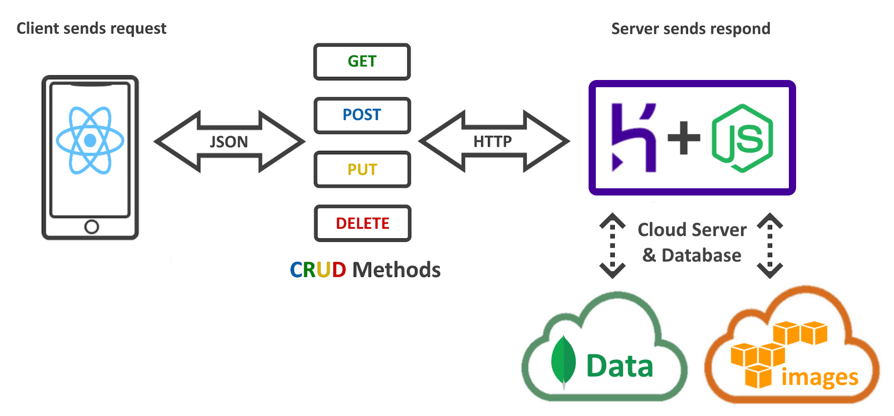

# iFarmo API

This is a repository that contains necessary project files for the iFarmo's backend server.

Below is the diagram that shows the architecture of the API and technologies used. The API itself is a RESTful NodeJS application with multiple endpoints that connect the frontend (ReactNative mobile app), the MongoDB Atlas cloud database (for storing data), and the AWS S3 cloud storage (for images). 



The API is deployed on Heroku, and its API calls are accessible via link: https://nodejs-ifarmo.herokuapp.com/api/.

The documentation for the API is available at link: https://documenter.getpostman.com/view/13899012/UyxbrqHi.

<br>

# iFarmo API Local Installation

## Preparing local environment
1. Install npm (node package manager) https://nodejs.org/en/download/.
2. Install VSCode with plugin "Prettier".
3. Install Postman for API testing.
4. [Optional] Install desired VSCode plugins to easen your coding.
5. [Optional] Install GitHub Desktop.

## Setup MongoDB Atlas 
1. Create a MongoDB account.
2. Create a project, a cluster, and a database for this app, or request to be added to an existing cloud database.
3. In the specified cluster, click **Connect**, then choose **Connect to your cloud application**, copy the connection link, replace the necessary keywords, and add that link to the **.env** file (later in the next section).

## Launch and test the server locally
1. Open terminal in the project's folder.
2. Install required packages using ```npm ci```.
`Note`: You may use ```npm install <your_module>``` to install additional modules but do NOT use ```npm install``` to install required modules listed in package.json to avoid version conflicts, and instead use ```npm ci``` in those cases. For more information, check here: https://stackoverflow.com/questions/48524417/should-the-package-lock-json-file-be-added-to-gitignore.~~
3. Create **.env** file in the project's folder and add your database connection link using username and password for the MongoDB database (reference to the section above), Token secret, and Port number like so:
    ```
    DB_CONNECTION = ...
    TOKEN_SECRET = ...
    PORT = ... ```
4. Run ```npm start``` to run the server.

<br>

# Front-end App

The iFarmo front-end is React Native mobile on Expo. For more information, visit the GitHub repository link: https://github.com/Chris-Hayashi/iFarmo-Front-End